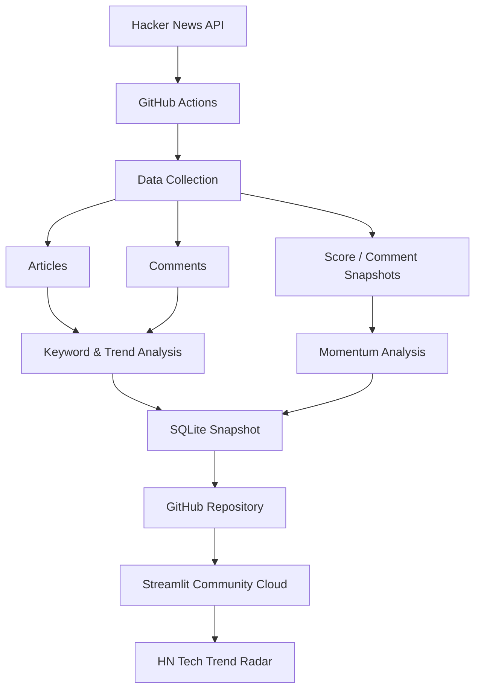
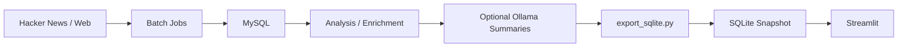

# HN Tech Trend Radar

**HN Tech Trend Radar** is a dashboard for discovering and analyzing technical trends on Hacker News.

Instead of simply listing popular stories, the application continuously collects Hacker News data and analyzes **story momentum, technical keywords, topic trends, related stories, and discussion activity**. The public dashboard is built with Streamlit and uses a read-only SQLite snapshot that is automatically updated through GitHub Actions.

**Live Demo:**  
https://hacker-news-dashboard-eclsl2atzrrm6defzulnad.streamlit.app/


---

## Overview

Hacker News contains a large amount of information about emerging technologies, but identifying **what is currently gaining attention** can be difficult from ranking scores alone.

HN Tech Trend Radar analyzes Hacker News from several perspectives:

- Which stories are gaining attention quickly?
- Which technical terms are appearing frequently or emerging recently?
- Which technology categories are becoming more active?
- Which stories discuss similar topics across different sources?
- How have a story's score and comment activity changed over time?

The application combines data collection, text analysis, trend analysis, and visualization into a single dashboard.

---

## Features

### Fast-Moving Stories

The dashboard detects stories that are currently gaining attention using their score, comment activity, and observed movement over time.

This makes it possible to identify rapidly growing stories that may not yet have the highest absolute Hacker News score.


### Article Explorer

Articles can be searched, filtered, and sorted by:

- Time window
- Technology category
- Hacker News post type
- Minimum HN score
- Minimum number of comments
- Importance
- Recency
- HN score
- Comment count
- Momentum

Search results can also be exported as CSV.

Each article card displays its HN score, comments, 24-hour movement, importance score, category, source, and extracted keywords.

### Article Analysis

Individual stories can be expanded for more detailed analysis, including:

- Article snippet
- Japanese summary when available
- Extracted keywords
- Score and comment history
- Hacker News comments
- Related articles

Related stories are identified using textual similarity.

<!-- Screenshot suggestion:
Insert a screenshot of one expanded article here.
Recommended content:
- Story title
- HN Score / Comments / 24h Change / Importance
- Keywords
- Score/comment line chart
- Related articles if they fit on the screen

This screenshot is useful because it demonstrates that the project performs analysis rather than simply displaying HN data.

Example:

-->

### Technology Trend Discovery

The Trends view analyzes which technical terms are receiving attention.

It provides:

- Notable and emerging terms
- Historical frequency of selected terms
- Category-level term trends
- Rising and cooling terms
- Category momentum

Keyword analysis combines statistical text analysis with named entity recognition so that both technical phrases and entities such as technologies, products, and organizations can be surfaced.

<!-- Screenshot suggestion:
Insert a screenshot of the "Trends" tab here.
The best screenshot would include:
- Notable terms bar chart
- Term history chart
- Category movement or Rising and cooling terms

Example:

-->

### Data Freshness Monitoring

Because trend analysis depends on continuously collected data, the dashboard also exposes the current state of the analysis pipeline.

The Data Freshness view shows:

- Last data update
- Number of analyzed stories
- Keyword coverage
- Category coverage
- Snapshot coverage
- Comment coverage
- Recent pipeline execution history

This makes the limitations and completeness of the currently displayed analysis visible to users.

---

## Tech Stack

| Area | Technologies |
|---|---|
| Language | Python |
| Dashboard | Streamlit |
| Visualization | Altair |
| Data Processing | Pandas, NumPy |
| Text Analysis | scikit-learn, spaCy |
| NLP Methods | TF-IDF, Named Entity Recognition |
| Topic Analysis | K-Means, cosine similarity, Truncated SVD |
| Public Database | SQLite |
| Local Database | MySQL |
| Data Collection | Hacker News API, Requests, BeautifulSoup |
| Scheduling | GitHub Actions, APScheduler |
| Optional Summarization | Ollama |
| Deployment | Streamlit Community Cloud |

---

## Architecture

The public version is designed to run without a continuously available external database server.



GitHub Actions runs the public data-update pipeline every six hours. The resulting SQLite database is committed to the repository and read directly by the Streamlit application.

This keeps the deployed dashboard **read-only and self-contained**, without requiring a separate production database server.

### Extended Local Pipeline

The repository also contains a local MySQL-based pipeline for additional data collection and enrichment.



---

## Analysis Methods

### Importance Score

Ranking stories only by Hacker News score can favor already established stories and may fail to highlight stories that are currently growing quickly.

To provide a broader measure of importance, the dashboard combines three signals:

| Signal | Weight |
|---|---:|
| HN Score | 45% |
| Comment Count | 30% |
| Momentum | 25% |

Each signal is normalized before the weighted score is calculated.

The purpose of this metric is not to replace the original Hacker News ranking, but to provide another view that considers both **overall popularity and recent activity**.

### Keyword Extraction: TF-IDF + Named Entity Recognition

Keyword extraction combines **TF-IDF** with **Named Entity Recognition (NER)**.

TF-IDF is useful for identifying terms that characterize individual stories, while NER helps surface meaningful entities such as:

- Organizations
- Products
- People
- Locations
- Events

The title, article snippet, and comments are given different weights because they contribute different levels of information about the main topic.

The current weighting is:

```text
Title     × 3.0
Snippet   × 1.5
Comments  × 0.5
```

Multi-word technical phrases and named entities are also prioritized to reduce generic or uninformative keywords.

### Story Similarity and Topic Analysis

Textual similarity is used to identify related stories.

Documents are represented using TF-IDF features and compared using cosine similarity. For exploratory topic analysis, K-Means clustering is used to group similar documents, while Truncated SVD provides a lower-dimensional representation when needed.

### Momentum Analysis

Hacker News stories can change rapidly after publication.

The system periodically records score and comment snapshots so that recent movement can be distinguished from static popularity.

This allows the dashboard to surface stories that are **currently accelerating**, rather than only stories with already high scores.

---

## Key Design Decisions

### 1. Read-Only SQLite for the Public Application

A traditional deployment could connect Streamlit directly to a MySQL or PostgreSQL server.

For this portfolio project, however, the public dashboard uses a committed SQLite snapshot.

```text
Data Collection
      ↓
SQLite Snapshot
      ↓
GitHub
      ↓
Streamlit Community Cloud
```

This approach was selected because it:

- avoids requiring a separate database server for the public demo;
- keeps deployment inexpensive and simple;
- makes the public application read-only;
- separates data collection from dashboard serving.

The trade-off is that the dashboard displays periodically refreshed data rather than querying a continuously updated production database.

### 2. Separate Collection from Visualization

Data collection and analysis are kept separate from the Streamlit interface.

The `batch/` and `scripts/` components handle data acquisition and processing, while the public application primarily reads processed data through `app/db.py`.

This separation keeps expensive or failure-prone collection tasks away from interactive dashboard requests.

### 3. Analyze Trends Instead of Only Popularity

The project intentionally distinguishes between:

- **Popularity** — how much attention a story has accumulated
- **Momentum** — how quickly attention is currently increasing
- **Trends** — which technical topics are appearing or changing across stories

This makes the dashboard useful not only for finding popular Hacker News posts but also for discovering emerging technical topics.

### 4. Make Data Quality Visible

Automatically collected data is not always complete.

Instead of hiding this limitation, the dashboard exposes keyword, category, snapshot, and comment coverage in the Data Freshness view.

This helps users understand how much evidence is currently available for each type of analysis.

---

## Repository Structure

```text
Hacker-News-Dashboard/
├── app/
│   ├── main.py
│   ├── db.py
│   ├── analysis.py
│   └── requirements.txt
│
├── batch/
│   ├── batch_run.py
│   ├── fetch_articles.py
│   ├── fetch_comments.py
│   ├── record_snapshots.py
│   ├── extract_keywords.py
│   ├── enrich_articles.py
│   ├── summarize_articles.py
│   └── scheduler.py
│
├── scripts/
│   ├── update_sqlite_data.py
│   ├── export_sqlite.py
│   ├── backfill_analytics.py
│   ├── rebuild_keywords.py
│   ├── reclassify_articles.py
│   ├── migrate.py
│   └── migrate.sql
│
├── data/
│   └── hn_dashboard.sqlite
│
├── tests/
│   ├── test_scoring.py
│   └── test_enrichment_analysis.py
│
├── .github/
│   └── workflows/
│       └── update-news-data.yml
│
├── requirements.txt
└── README.md
```

### Main Components

| Component | Role |
|---|---|
| `app/main.py` | Streamlit dashboard and visualization |
| `app/db.py` | Database queries and public data-access helpers |
| `app/analysis.py` | Keyword extraction, clustering, and similarity analysis |
| `scripts/update_sqlite_data.py` | Public SQLite data-update pipeline |
| `batch/` | Local MySQL-based collection and enrichment jobs |
| `scripts/export_sqlite.py` | Exports processed MySQL data to the public SQLite snapshot |
| `tests/` | Unit tests for scoring and analysis behavior |

---

## Public Data Update

The public dataset is automatically refreshed with GitHub Actions.

The workflow runs every six hours and executes:

```bash
python scripts/update_sqlite_data.py \
  --database data/hn_dashboard.sqlite \
  --days 30
```

If the database changes, the updated SQLite snapshot is committed automatically.

```text
GitHub Actions
      ↓
Hacker News API
      ↓
update_sqlite_data.py
      ↓
hn_dashboard.sqlite
      ↓
Git commit
      ↓
Streamlit
```

---

## Local Setup

### 1. Clone the repository

```bash
git clone https://github.com/taiyo551/Hacker-News-Dashboard.git
cd Hacker-News-Dashboard
```

### 2. Create a virtual environment

#### Windows

```powershell
python -m venv venv
venv\Scripts\activate
```

#### Linux / macOS

```bash
python -m venv venv
source venv/bin/activate
```

### 3. Install dependencies

```bash
python -m pip install --upgrade pip
pip install -r requirements.txt
```

### 4. Run the dashboard

The repository already contains the public SQLite snapshot.

```bash
streamlit run app/main.py
```

The dashboard will use:

```text
data/hn_dashboard.sqlite
```

by default.

---

## Local MySQL Pipeline

For local batch processing, configure the following environment variables:

```text
DB_HOST
DB_PORT
DB_USER
DB_PASSWORD
DB_NAME
```

A local `.env` file can also be used.

Database migration:

```bash
python scripts/migrate.py
```

Example batch execution:

```bash
python batch/fetch_articles.py
python batch/record_snapshots.py
python batch/enrich_articles.py
python batch/fetch_comments.py
python batch/extract_keywords.py
python batch/summarize_articles.py
```

Then export the processed data to SQLite:

```bash
python scripts/export_sqlite.py
```

The export uses the most recent 30 days by default.

To change the window:

```bash
python scripts/export_sqlite.py --days 14
```

---

## Optional Japanese Summarization

The local pipeline supports Japanese article-title summarization through an Ollama server.

Configure:

```text
OLLAMA_URL
OLLAMA_MODEL
```

The default model name is:

```text
gemma3:4b
```

Summarization is optional and is not required to run the public Streamlit dashboard.

---

## Tests

Unit tests cover important analysis and scoring behavior, including:

- Importance score calculation
- Keyword normalization
- Category classification
- Search behavior
- Story clustering
- Momentum calculation
- Keyword trend detection
- Enrichment and analysis logic

Run all tests with:

```bash
python -m unittest discover -s tests -v
```

---

## Data Source

The primary data source is the **Hacker News API**.

The application stores and analyzes information such as:

- Story title
- URL
- Author
- HN score
- Number of comments
- Publication time
- Story type
- Comments
- Periodic score/comment snapshots

The project is an independent portfolio project and is not affiliated with Hacker News or Y Combinator.
